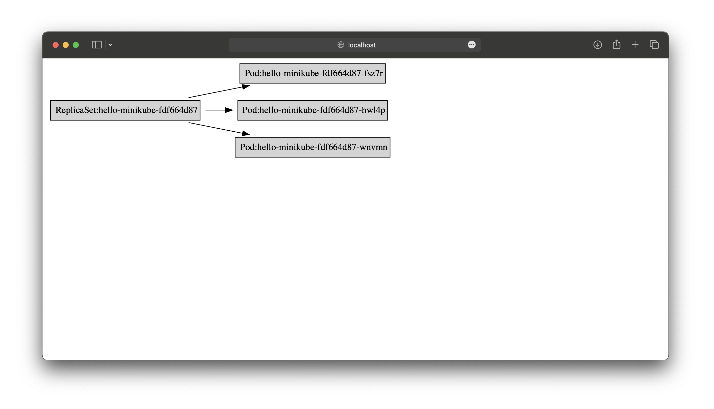

# 🌺 watchhttp

> Run command periodically and expose latest STDOUT as HTTP endpoint

```bash
go install github.com/nikolaydubina/watchhttp@latest
```

### Live visualization with difference

TODO
HTML + refetch in loop
https://www.w3schools.com/jsref/met_loc_reload.asp

### Fetch and transform periodically with `curl` and `jq`

```bash
watchhttp -t 5s -json -- /bin/sh -c 'curl "https://api.open-meteo.com/v1/forecast?latitude=52.52&longitude=13.41&current_weather=true&hourly=temperature_2m,relativehumidity_2m,windspeed_10m" | jq "del(.hourly)"'
```

```bash
$ curl localhost:9000/
{
  "latitude": 52.52,
  "longitude": 13.419998,
  "generationtime_ms": 0.635981559753418,
  "utc_offset_seconds": 0,
  "timezone": "GMT",
  "timezone_abbreviation": "GMT",
  "elevation": 38,
  "current_weather": {
    "temperature": 1.3,
    "windspeed": 8.4,
    "winddirection": 220,
    "weathercode": 3,
    "time": "2023-03-12T09:00"
  },
  "hourly_units": {
    "time": "iso8601",
    "temperature_2m": "°C",
    "relativehumidity_2m": "%",
    "windspeed_10m": "km/h"
  }
}
```

### Live graph of Kubernetes resources with `kubectl` and `graphviz`

```bash
go install github.com/nikolaydubina/jsonl-graph@latest
```

```bash
watchhttp -t 3s -p 9000 -- /bin/sh -c "kubectl get pods -o json | jq '.items[] | {to: (.kind + \":\" + .metadata.name), from: (.metadata.ownerReferences[].kind + \":\" + .metadata.ownerReferences[].name)}' | jsonl-graph | dot -Tsvg"
```



### Live status of Kubernetes resource with `kubectl`

```bash
watchhttp -t 3s -p 9000 -- kubectl describe deployment hello-minikube
```


### Live system metrics with `vmstat`

```bash
watchhttp vmstat
```

```bash
$ curl localhost:9000/
Mach Virtual Memory Statistics: (page size of 16384 bytes)
Pages free:                             1616097.
Pages active:                            914186.
Pages inactive:                          579357.
Pages speculative:                       829846.
Pages throttled:                              0.
Pages wired down:                        164337.
Pages purgeable:                         125376.
"Translation faults":                2059157267.
Pages copy-on-write:                   58902729.
Pages zero filled:                   1573609407.
Pages reactivated:                       577992.
Pages purged:                          17881481.
File-backed pages:                      1300312.
Anonymous pages:                        1023077.
Pages stored in compressor:              202931.
Pages occupied by compressor:             35364.
Decompressions:                          973775.
Compressions:                           1404319.
Pageins:                               23222205.
Pageouts:                                 12866.
Swapins:                                 435185.
Swapouts:                                477406.
```

### Watch file `tail` or `cat`

```bash
watchhttp tail /var/log/system.log
```

```bash
$ curl localhost:9000/            
Mar 12 16:16:07 Nikolays-MacBook-Pro syslogd[532]: ASL Sender Statistics
Mar 12 16:32:06 Nikolays-MacBook-Pro syslogd[532]: ASL Sender Statistics
Mar 12 16:48:15 Nikolays-MacBook-Pro syslogd[532]: ASL Sender Statistics
Mar 12 17:04:22 Nikolays-MacBook-Pro syslogd[532]: ASL Sender Statistics
Mar 12 17:22:24 Nikolays-MacBook-Pro syslogd[532]: ASL Sender Statistics
Mar 12 17:33:45 Nikolays-MacBook-Pro MobileDeviceUpdater[4765]: Entered:_AMMuxedVersion2DeviceConnected, mux-device:4541
Mar 12 17:33:45 Nikolays-MacBook-Pro syslogd[532]: ASL Sender Statistics
Mar 12 17:33:45 Nikolays-MacBook-Pro AMPDeviceDiscoveryAgent[1146]: Entered:_AMMuxedVersion2DeviceConnected, mux-device:4541
Mar 12 17:33:47 Nikolays-MacBook-Pro AMPDevicesAgent[67221]: Entered:_AMMuxedVersion2DeviceConnected, mux-device:4541
Mar 12 17:44:54 Nikolays-MacBook-Pro syslogd[532]: ASL Sender Statistics
```

---

### Appendix A: Existing Tools

- as of 2023-03-12, [awesome-go](http://github.com/avelino/awesome-go) does not mention any tools that can do this
- `netcat` can not do this

### Appendix B: Alternative with file server + bash

Similar effect can be achieved with file server and bash, albeit headers would not be set.

```go
package main

import "net/http"

func main() { http.ListenAndServe(":9000", http.FileServer(http.Dir("."))) }
```
```bash
$ while sleep 5; do <something> > <file> ; done
```

### Appendix C: Paths Not Taken

> Expose STDIN as HTTP endpoint

The problem is how to differentate separate responses?
Is empty line valid separator of responses?
There are clearly interesting eaxmples with UNIX pipes and `tail -f`, logs, WebSockets.
However, that may need separate tool.

> Stream `top`, k9s, [datadash](https://github.com/keithknott26/datadash) to browser in HTML

First, those tools re-render terminal output at their own interval.
It would take some effort, but effectivelly this is emulating terminal rendering in browser.
Issue of converting terminal escaped ASCII to HTML output colors.
As next step, you would want to also pass to STDIN through browser too.
Overall, this is separate problem of exposing terminal throuhg browser.
